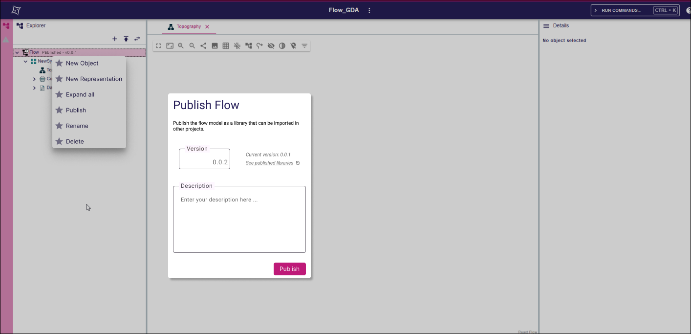

= Add support for library publication

== Problem

SysON doesn't provide an  **in-application** way to import models from other projects.
The current import/export mechanisms rely on generating a textual SysML file, and uploading such file in a project to import it.

When exported models are used as shared reusable components, it is the responsibility of the stakeholders to:
- Store the shared models in an external location
- Ensure that every user is working on the same version of the shared model
- Coordinate to export a new version when needed, and import it in all the dependent projects

These processes are error-prone, and could be more controlled if they all happened inside the application.

== Key Result

SysON users should be able to:
- Publish a model with a given version number

== Solution

The contextual menu of models containing _LibraryPackage_ elements in the explorer contains a new _Publish_ tool.
This tool opens a pop-up that asks the user for a version number and a description.
Note that this tool is visible in the contextual menu of models that contain only _LibraryPackage_ top-level elements.
It won't be possible to publish models that contain a mix of _LibraryPackage_ and _Package_ as their top-level elements.

The actual publication of the model is handled as a https://github.com/eclipse-sirius/sirius-web/pull/4284[Sirius Web Workflow]. 
It is stored in the artifact table with the provided information, and can be viewed in the `/projectId/artifacts` page.

**Note**: Sirius Web will not allow to publish a model with a version number that matches an already published version of the model. 
User will have to update the version of the model if they want to re-publish it.

=== Scenario

1. User publishes a model with a _LibraryPackage_
- The user creates a new project
- The user creates a _LibraryPackage_ in the project with some content
- The user clicks on the contextual menu of the model and selects the _Publish_ tool
- The user fills requested information in the popup (version number, comment, etc) and presses _Publish_
- A message is displayed indicating that the publication was successful
- The user can navigate to `/projectId/artifacts` to view the libraries published by the project

2. User tries to publish a model without a _LibraryPackage_
- The user creates a new project
- The user creates a _Package_ in the project with some content
- The user clicks on the contextual menu of the model 
- The _Publish_ tool is not available (only models containing _LibraryPackage_ instances can be published)

3. User tries to publish a model with an existing version number
- The user performs the same actions as in scenario 1, but enters a version number that matches an already  published version of the same model.
- An error message is displayed indicated that the publication wasn't successful, and inviting the user to enter another version number.

=== Breadboarding

Publish model action in the _Model_ contextual menu and _Publish_ popup.

- The current version of a model is displayed in the explorer next to its name.
- The _Publish_ action is visible in the contextual menu
- The _current version_ number shows the current version of the library (this version is the same as the one visible in the tree next to the model)
- The _see published libraries_ link opens a page in a new tab that redirects to the page containing the list of artifacts published by the project (see this [Sirius Web shape](https://github.com/eclipse-sirius/sirius-web/pull/4284) for more information) 
- The _version_ text field is preset with the current version number incremented on the minor version (the user can change it manually if needed)
- The _description_ text field is empty by default.

=== Cutting backs
- (Nice to have) the _see published libraries_ link would be nice to let user inspect what artifacts have been published from this project (e.g. to choose their new version number accordingly).

== Rabbit holes

== No-gos

This shape doesn't address the issue of importing a published model.
This will be done in a future shape.